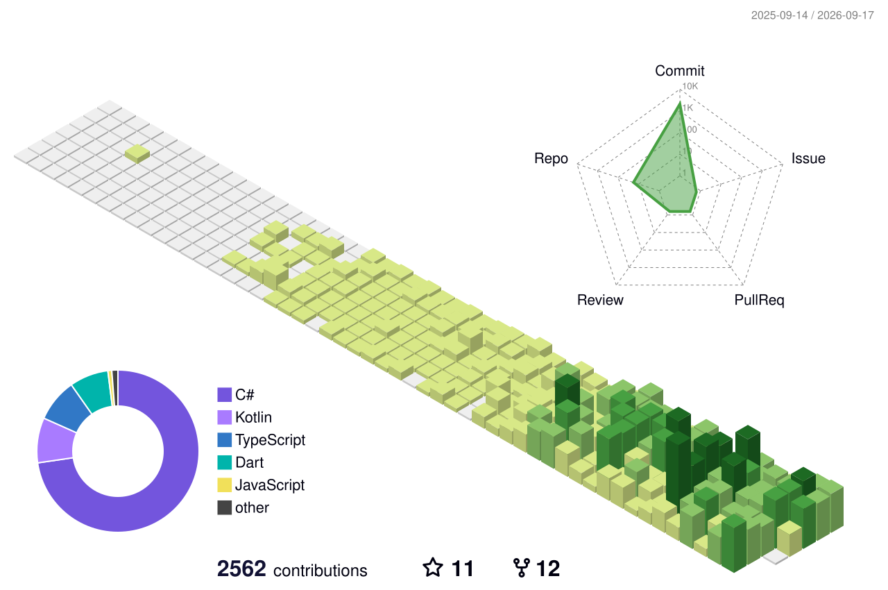

  <!-- 상단 캡슐 헤더 -->
  

   

  <!-- 3D 기여도 차트 -->
  

    

  <!-- GitHub Stats & Top Languages 카드 -->
  
  

 

- start : 2015. 03
- 방문해 주셔서 감사합니다. : - )
- mail : lts06069@naver.com
- HomePage : https://lts0606.tistory.com

 

    <!-- 하단 이미지 차트 -->
    

